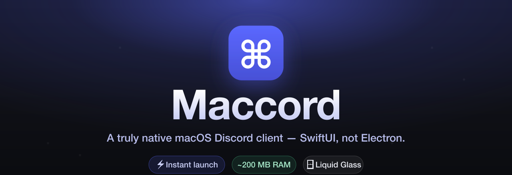
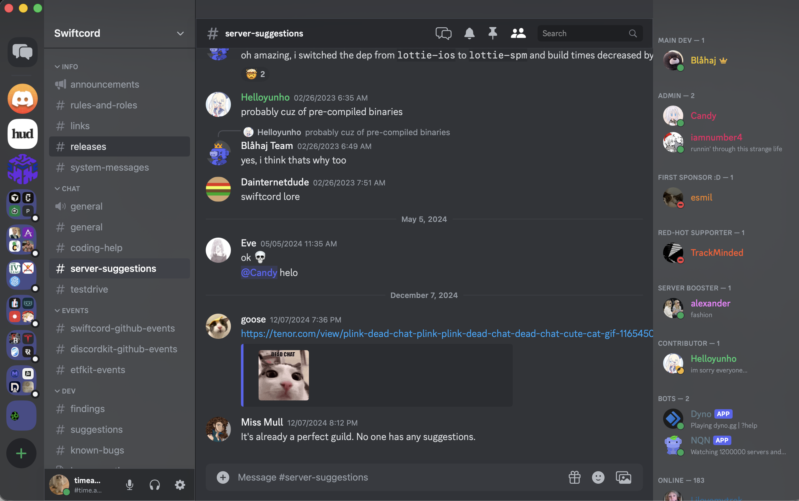
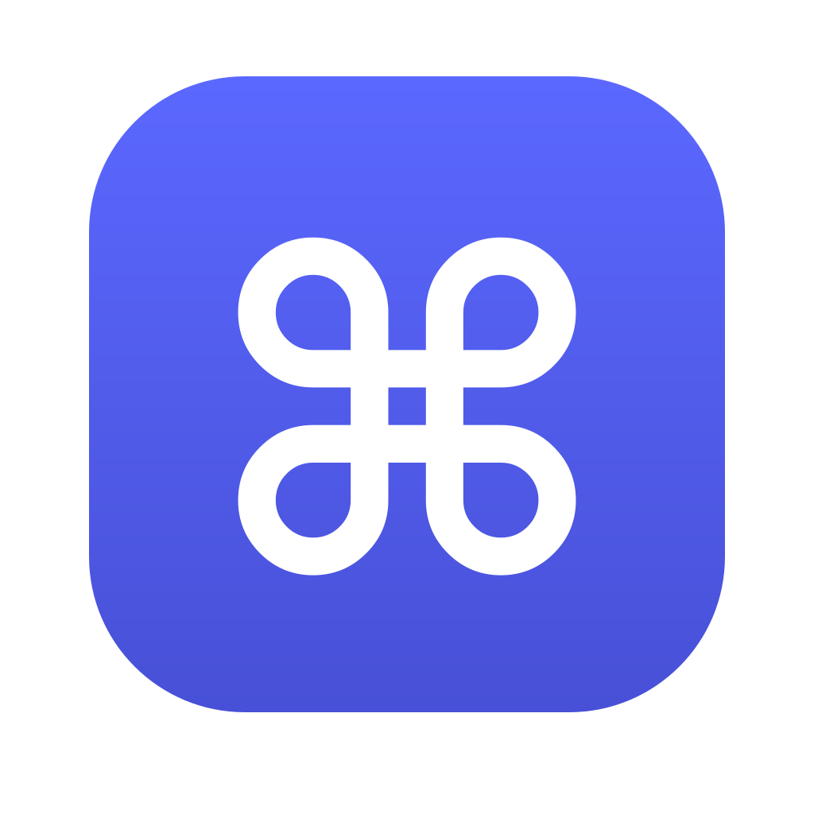

<div align="center">



<br/>


[](https://github.com/time-attack/maccord/stargazers)


### A truly native macOS Discord client — Swift 6 + SwiftUI, not Electron.

Log in with your own Discord account and get the familiar four‑pane Discord, rendered with
**Liquid Glass** (macOS 26 Tahoe), speaking the Discord v10 REST + Gateway protocols directly
— no Chromium, a fraction of the RAM, instant launch.



</div>

---

> [!WARNING]
> **Using a *user* token from a non‑official client ("self‑botting") violates Discord's
> Terms of Service and can get your account terminated.** Maccord stores your token only
> on your machine and sends it only to Discord over TLS, but the risk is yours. The same
> networking layer works with a **bot token** too if you'd rather stay within ToS.

## ⚡ Why Maccord?

The official Discord desktop app is an Electron app: it ships an entire copy of Chromium and
runs your chat as a web page across half a dozen processes. Maccord is the opposite — a
hand‑written native Mac app.

<div align="center">

|  |  **Maccord** | 🌐 **Discord (Electron)** |
|:--|:--|:--|
| **Engine** | Native SwiftUI / AppKit | Chromium + Node |
| **Processes** | **One** | ~6 (main, GPU, renderers, utility…) |
| **Memory** | **~200 MB** (measured) | commonly **600 MB – 1.5 GB+** |
| **Launch** | **Instant** — no web runtime | Cold‑starts a browser |
| **Rendering** | Real **Liquid Glass**, 120 Hz | DOM / CSS in a web view |
| **Energy** | Low (native, GPU‑aware) | High (full browser) |
| **Disk** | A few MB | 150 MB+ payload |

</div>

It's not a clone or a web wrapper — it talks to Discord's wire protocol itself and draws the
UI pixel‑for‑pixel with native views.

## ✨ Features

> 🔎 **Quick Switcher (`⌘K`)** — search your **entire account**: every server, every channel,
> every DM, every friend. Fuzzy, space‑insensitive matching (`gamedev` finds *Game Dev*),
> channels you can't view are filtered out, recents first, arrow‑key + click navigation. It
> fetches every server's channel list up front so the index is always complete.

<table>
<tr>
<td width="50%" valign="top">

**🗂️ Servers, channels & DMs**
- Four‑pane layout: rail → sidebar → chat → members
- Server folders, categories, unread / mention badges
- Text, announcement, forum, voice, stage & threads
- DMs, **group DMs**, friends list with live presence

**💬 Messages & composer**
- Full **markdown** (bold, headers, lists, spoilers, masked links, subtext)
- **Reactions** + emoji picker, reaction details
- Replies, **silent replies**, **forwarding**, edit, pins & jump‑to‑pin
- **Message search** with filters, jump‑to‑result
- Drafts, `⌘B/I/U`, drag‑drop / paste / file uploads

</td>
<td width="50%" valign="top">

**👥 People, presence & moderation**
- Role colors & hoisting, presence dots, activity, rich profiles
- Permission‑gated **kick / ban / timeout**, role assignment
- **Server management**: join, invites (expiry / max‑uses), ban list

**🪄 Platform polish**
- Settings persistence (prefs, mutes, notif levels, drafts)
- Native notifications (avatar, click‑to‑jump, focus‑aware)
- Dock unread badge, `⌘/` shortcut reference, text zoom
- Token saved across rebuilds — **no re‑login every run**

</td>
</tr>
</table>

## 📊 Performance

Measured on this machine, a typical Maccord session runs as a **single ~200 MB process**.
Discord's Electron build spawns a Chromium main process plus a GPU process and several
renderer / utility processes that together commonly sit well above **600 MB**. Maccord has no
web runtime to boot, so it launches instantly and idles cheaply.

> Numbers vary with how many servers you're in and how much history you've scrolled — Maccord
> background‑loads channel lists and unread history to keep the switcher and sidebar snappy.

## 🚀 Install

**Download** the latest `Maccord.app` from the **[Releases](../../releases)** page, drag it to
`/Applications`, and launch it. It's ad‑hoc signed, so the first launch may need **right‑click →
Open** (or `xattr -dr com.apple.quarantine /Applications/Maccord.app`).

**Or build from source:**

```bash
git clone https://github.com/time-attack/maccord.git
cd maccord
swift build && swift test          # compile + test the core
scripts/build-app.sh release       # assemble dist/Maccord.app (icon + Keychain entitlement)
open dist/Maccord.app
```

You can also open `Package.swift` in Xcode and run the `maccord` scheme.

## 🔑 Logging in

On first launch, paste your Discord token into the login screen. Your token is saved to the
macOS **Keychain**, with a file‑permission‑protected fallback in
`~/Library/Application Support/Maccord/` so that **ad‑hoc dev rebuilds don't log you out** —
later launches connect automatically. Log out from the user panel to wipe both.

## 🏗️ Architecture

A thin SwiftUI app over a Foundation‑only core library.

```
Sources/
  MaccordCore/            # Foundation only — unit‑testable, no UI
    Models/               # Codable Discord types (Snowflake, Guild, Message, …)
    Networking/           # actor RESTClient + typed v10 endpoints + rate limiter
    Gateway/              # actor GatewaySocket — WebSocket, heartbeat, resume,
                          #   typed AsyncStream<GatewayEvent>
    Persistence/          # actor KeychainStore + TokenStore (+ file fallback)
  maccord/                # SwiftUI app
    State/                # @MainActor @Observable stores + EventApplier
    DesignSystem/         # color/layout/type tokens, Liquid Glass, markdown
    Views/                # GuildRail · ChannelSidebar · Chat · Members · QuickSwitcher · …
    Services/             # ImageCache, notifications, fonts
```

**Data flow:** `GatewaySocket` (actor) yields a `Sendable AsyncStream<GatewayEvent>` → a single
`@MainActor` pump in `AppState` → `EventApplier` mutates the `@Observable` stores → SwiftUI
re‑renders. REST calls flow into the same stores. Full notes in [`ARCHITECTURE.md`](ARCHITECTURE.md).

## ⌨️ Keyboard shortcuts

| Keys | Action | | Keys | Action |
|---|---|---|---|---|
| `⌘K` | Quick Switcher | | `⌘B/I/U` | Bold / italic / underline |
| `⌘U` | Toggle member list | | `⌘=` `⌘−` | Text size |
| `⌥↑` `⌥↓` | Prev / next channel | | `⌘/` | Shortcut reference |

## 🚧 Not (yet) implemented

Honest scope — deliberately out of scope for now: **voice / video** + DAVE E2EE · **GIF picker**
(Tenor/Giphy), Lottie stickers, inline media players · server‑side **link unfurling**, full
**forum** / **stage** browsing · **edit history**, **slash commands**, **audit log**,
multi‑account switcher, drag‑to‑reorder · full role / emoji **editors**.

---

<div align="center">
<br/>
<sub>Built from scratch in <b>Swift 6 + SwiftUI</b> for macOS 26 Tahoe · Not affiliated with Discord</sub>
</div>
